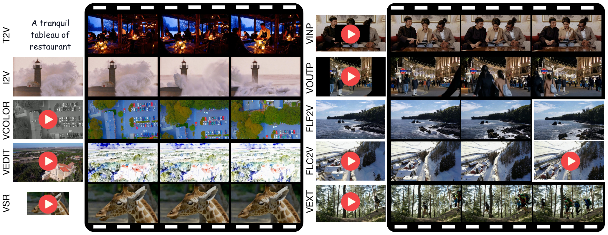
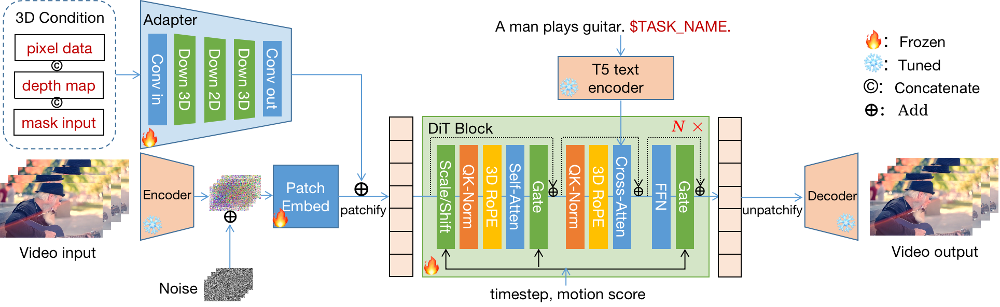

<div align="center">

## Many-for-Many: Unify the Training of Multiple Video and Image Generation and Manipulation Tasks

<a href="https://leeruibin.github.io/MfMPage/"></a> &ensp;
<a href="https://arxiv.org/abs/xxx"></a> &ensp;
<a href="https://github.com/SandAI-org/MAGI-1/LICENSE"></a> &ensp;

</div>

This repository contains the code for the MfM model, pre-trained weights and inference code. You can find more information on our paper xxx. 🚀✨

<div align="center">
  <video src="assets/MfM_demo.mp4" width="70%" poster=""> </video>
</div>

## 🔥🔥🔥 Latest News

- Inference code and model weights, comming soon.

## 📌 Progress Checklist
<!-- ✅ -->

- [x] **⬜️ Inference Code**  
- [x] **⬜️ Model Weights**

## Introduction

In this work, we introduce a unified framework, namely **many-for-many**, which leverages the available training data from many different visual generation and manipulation tasks to train a single model for those different tasks. Specifically, we design a lightweight adapter to unify the different conditions in different tasks, then employ a joint image-video learning strategy to progressively train the model from scratch. Our joint learning leads to a unified visual generation and manipulation model with improved video generation performance. In addition, we introduce depth maps as a condition to help our model better perceive the 3D space in visual generation. Two versions of our model are trained with different model sizes (8B and 2B), each of which can perform more than 10 different tasks. In particular, our 8B model demonstrates highly competitive performance in video generation tasks compared to open-source and even commercial engines.




## Architecture



## Citation

If you find our code or model useful in your research, please cite:

```bibtex
@article{li2024RORem,
  title={Many-for-Many: Unify the Training of Multiple Video and Image Generation and Manipulation Tasks},
  author={Tao yang, Ruibin Li, Yangming Shi, Yuqi Zhang, Qide Dong, Haoran Cheng, Weiguo Feng, Shilei Wen, Bingyue Peng, Lei Zhang},
  year={2025},
  booktitle={arxiv},
}
```